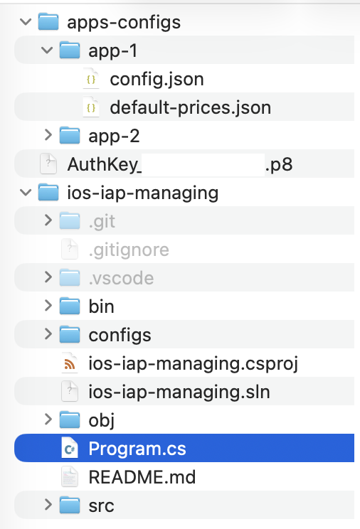

***Looking for [Google Play Store](https://github.com/ANU-CHEEKI-BREEKI/google-play-console-prices-localizer) analog?***

---

Have you ever created ***IAPs*** (In-App Purchases) for your app on Apple App Store?

Have you thought about ***setting regional prices*** to make purchases more accessible in countries with lower purchasing power?

Doing this ***manually***, even for a single IAP, ***is a nightmare...***

In this repository, there is a program that will help you ***automatically*** update all prices according to your *regional pricing template*.

---

### How to use

One command:

    dotnet run -- localize

And all prices will be localized!

**Or you can run the program without parameters. It will display a more detailed help in the console.**

**You also need to set up `../config.json` file** [Instructions from Apple](https://developer.apple.com/documentation/appstoreserverapi/creating-api-keys-to-authorize-api-requests)

Also you can provide some comand parameters each time calling `localize`, or setup this config to use 'default' parameters

    {
        "KeyId": "XYZ123ABC",
        "IssuerId": "11111111-AABB-CCDD-EEFF-123456ABCDEF",
        "PrivateKeyFilePath": "../../AuthKey_XYZ123ABC.p8",

        "AppId": "1234567890", // your app AppleId from App Store Connect App info page
        "DefaultPricesFilePath": "./default-prices.json",
        "LocalizedPricesTemplateFilePath": "",
        
        "DefaultRegion": "USA",
        "Iap": ""
    }

all paths in config are relative to config.json location

there are example of `../default-prices.json`

    {
        "crystals_1": "1",
        "crystals_6": "100",
        "disable_ads": "10",
    }

you can define rounded prices, the program will subtract 0.01 from them automatically

There are your default setup if you run program as `dotnet run -- localize` instead of running executable

---

### How it works

In the file `./configs/localized-prices-template.json`, there are multipliers for each country's prices.

    {
        "USA": 1.0,
        "AFG": 0.25,
        "AGO": 0.4,
        "AIA": 1.0,
        "ALB": 0.5,
        "ARE": 1.0,
        "ARG": 0.4,
        "ARM": 0.45,
        //...
    }

- The program retrieves a list of all IAPs using the [App Store Connect API](https://developer.apple.com/documentation/appstoreconnectapi), and set base prices provided in `../default-prices.json` (you need to create it yourself)
This will reset their prices to the default price (just like you can do manually in the App Store Connect by clicking on "Edit").
- Then, the program multiplies the local prices by the corresponding multipliers from the `localized-prices-template.json` file.
- Then, 0.01 is subtracted from the price to make round prices like `10$` become `9.99$`.
- Since Apple des not allow to set any price you want, program vill search closest available price point in the list provided by [App Store Connect API](https://developer.apple.com/documentation/appstoreconnectapi)
- Finally, the program uses the [App Store Connect API](https://developer.apple.com/documentation/appstoreconnectapi) to update the local prices for IAPs in your project on the App Store Connect.

---

### The pain in the ass

#### not ads bad as you think

This programm uses Apple App Store Connect API Client .NET library generated by the OpenAPI Generator CLI tool.
And (AppStoreConnect.Net)[https://github.com/Redth/AppStoreConnectNet] utils. See [here](https://github.com/Redth/AppStoreConnectNet) how to build it yourself

Then you will need to `setup ios-iap-managing.sln` and `ios-iap-managing.csproj` to use generated project.
As you can se in my `.sln` i have it in a 2 folders up in hierarchy

#### annoing

For some reason [App Store Connect API](https://developer.apple.com/documentation/appstoreconnectapi) has only REST api and they suck. 
Its reaquired a LOT OF REQUEST to localize even single iap product.
So you probably will run this program before going to bed, or before launch break.

Localizing 27 products took ~2 hours for me. 

Also [App Store Connect API](https://developer.apple.com/documentation/appstoreconnectapi) has requests quota, so you cant spam your requests in multiple threads... 
There are a away to [manage requests rate limits](https://developer.apple.com/documentation/appstoreconnectapi/identifying-rate-limits), but i didnt implemented this here.

---

### A couple more commands

- 

    list [-l] [-v]

    description:
            Lists all One-time products in the project, and their prices for
            specified region.

    options:
    -p                           Include pricing
    -l                           Include local pricing for all regions. Only if -p is specified
    -v                           Include detailed verbose output
  
- 

    localize [--prices <path-to-default-prices.json>] [--localized-template <path-to-localized-template.json>] [-v] [-l]

    description:
            Recalculates prices for all regions based on the default currency price
            provided in your JSON config and localized prices template.

    options:
    --prices <path>              Specifies path to json with default prices in default currency. If not
                                specified, used path from global config json.
    --localized-template <path>  Specifies path to json with percentages for each region that needs to
                                be localized. Default path is:
                                ./configs/localized-prices-template.json
    -v                           Include additional verbose output
    -l                           Include local pricing for all regions

  
- 

    restore [--prices <path-to-default-prices.json>] [-v] [-l]

    description:
            Recalculates prices for all regions based on the default currency price
            provided in your JSON config.

    options:
    -v                           Include additional verbose output
    -l                           Include local pricing for all regions

---

