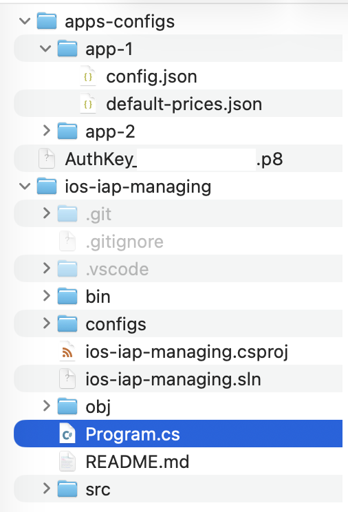

***Looking for [Google Play Store](https://github.com/ANU-CHEEKI-BREEKI/google-play-console-prices-localizer) analog?***

---

Have you ever created ***IAPs*** (In-App Purchases) for your app on Apple App Store?

Have you thought about ***setting regional prices*** to make purchases more accessible in countries with lower purchasing power?

Doing this ***manually***, even for a single IAP, ***is a nightmare...***

In this repository, there is a program that will help you ***automatically*** update all prices according to your *regional pricing template*.

---

### How to use

One command:

    dotnet run -- localize

And all prices will be localized!

**Or you can run the program without parameters. It will display a more detailed help in the console.**

**You also need to set up `../config.json` file** [Instructions from Apple](https://developer.apple.com/documentation/appstoreserverapi/creating-api-keys-to-authorize-api-requests)

Also you can provide some comand parameters each time calling `localize`, or setup this config to use 'default' parameters

    {
        "KeyId": "XYZ123ABC",
        "IssuerId": "11111111-AABB-CCDD-EEFF-123456ABCDEF",
        "PrivateKeyFilePath": "../../AuthKey_XYZ123ABC.p8",

        "AppId": "1234567890", // your app AppleId from App Store Connect App info page
        "DefaultPricesFilePath": "./default-prices.json",
        "LocalizedPricesTemplateFilePath": "",
        "ProductDefinitionsFilePath": "./product-definitions.csv",
        "AppMetadataFilePath": "",
        
        "DefaultRegion": "USA",
        "DefaultLocale": "en-US",
        "Iap": ""
    }

all paths in config are relative to config.json location

there are example of `../default-prices.json`

    {
        "crystals_1": "1",
        "crystals_6": "100",
        "disable_ads": "10",
    }

you can define rounded prices, the program will subtract 0.01 from them automatically

There are your default setup if you run program as `dotnet run -- localize` instead of running executable

---

### How it works

In the file `./configs/localized-prices-template.json`, there are multipliers for each country's prices.

    {
        "USA": 1.0,
        "AFG": 0.25,
        "AGO": 0.4,
        "AIA": 1.0,
        "ALB": 0.5,
        "ARE": 1.0,
        "ARG": 0.4,
        "ARM": 0.45,
        //...
    }

- The program retrieves a list of all IAPs using the [App Store Connect API](https://developer.apple.com/documentation/appstoreconnectapi), and set base prices provided in `../default-prices.json` (you need to create it yourself)
This will reset their prices to the default price (just like you can do manually in the App Store Connect by clicking on "Edit").
- Then, the program multiplies the local prices by the corresponding multipliers from the `localized-prices-template.json` file.
- Then, 0.01 is subtracted from the price to make round prices like `10$` become `9.99$`.
- Since Apple des not allow to set any price you want, program vill search closest available price point in the list provided by [App Store Connect API](https://developer.apple.com/documentation/appstoreconnectapi)
- Finally, the program uses the [App Store Connect API](https://developer.apple.com/documentation/appstoreconnectapi) to update the local prices for IAPs in your project on the App Store Connect.

---

### The pain in the ass

#### not ads bad as you think

This programm uses Apple App Store Connect API Client .NET library generated by the OpenAPI Generator CLI tool.
And (AppStoreConnect.Net)[https://github.com/Redth/AppStoreConnectNet] utils. See [here](https://github.com/Redth/AppStoreConnectNet) how to build it yourself

Then you will need to `setup ios-iap-managing.sln` and `ios-iap-managing.csproj` to use generated project.
As you can se in my `.sln` i have it in a 2 folders up in hierarchy

#### annoing

For some reason [App Store Connect API](https://developer.apple.com/documentation/appstoreconnectapi) has only REST api and they suck. 
Its reaquired a LOT OF REQUEST to localize even single iap product.
So you probably will run this program before going to bed, or before launch break.

Localizing 27 products took ~2 hours for me. 

Also [App Store Connect API](https://developer.apple.com/documentation/appstoreconnectapi) has requests quota, so you cant spam your requests in multiple threads... 
There are a away to [manage requests rate limits](https://developer.apple.com/documentation/appstoreconnectapi/identifying-rate-limits), but i didnt implemented this here.

---

### Profiles: never type `--config` again

The app configs live outside of this (public) repo, so every command used to need
`--config <path>`. Register the path once under a name instead:

    dotnet run -- config add titan-souls ../apps-configs/titan-souls
    dotnet run -- config add island-raid ../apps-configs/island-raid

The first profile you add becomes the current one, so from now on plain `dotnet run -- list`
just works. To switch:

    dotnet run -- config use island-raid
    dotnet run -- config list

    dotnet run -- list --profile titan-souls     # one-off, current profile stays

Profiles are stored in `~/.config/ios-iap/profiles.json`, the same way `gcloud` or `gh` keep
theirs. The config is picked in this order: `--config <path>`, `--profile <name>`, the current
profile, and finally `../config.json`.

---

### A couple more commands

- 

    list [-l] [-v]

    description:
            Lists all One-time products in the project, and their prices for
            specified region.

    options:
    -p                           Include pricing
    -l                           Include local pricing for all regions. Only if -p is specified
    -v                           Include detailed verbose output
  
- 

    localize [--prices <path-to-default-prices.json>] [--localized-template <path-to-localized-template.json>] [-v] [-l]

    description:
            Recalculates prices for all regions based on the default currency price
            provided in your JSON config and localized prices template.

    options:
    --prices <path>              Specifies path to json with default prices in default currency. If not
                                specified, used path from global config json.
    --localized-template <path>  Specifies path to json with percentages for each region that needs to
                                be localized. Default path is:
                                ./configs/localized-prices-template.json
    -v                           Include additional verbose output
    -l                           Include local pricing for all regions

  
- 

    restore [--prices <path-to-default-prices.json>] [-v] [-l]

    description:
            Recalculates prices for all regions based on the default currency price
            provided in your JSON config.

    options:
    -v                           Include additional verbose output
    -l                           Include local pricing for all regions

- 

    create-iaps [--products <path-to-product-definitions.csv>] [--locale <locale>] [-v]

    description:
            Creates In-App Purchases in App Store Connect from the product
            definitions csv. Products that already exist are not re-created.
            Every created product gets a localization (en-US by default), is made
            available in all territories, and receives its base price from the
            'default_price' column.
            If a product with the same product id already exists, it is skipped: it
            is never re-created and its prices are never touched. Only a missing
            localization or a missing availability is added to it.
            The csv separator is detected automatically, both ';' and ',' are
            supported.

    options:
    --products <path>            Specifies path to csv with product definitions. If not specified,
                                used path from global config json.
    --locale <locale>            Locale of the created localization. Default is en-US, or locale
                                specified in global config.json
    -v                           Include additional verbose output

- 

    config [list | add <name> <path> | use <name> | remove <name> | path]

    description:
            Manages named profiles, so a command can run without --config.
            A profile is just a name for a config.json path, kept in your home
            directory (`~/.config/ios-iap/profiles.json`).
            This command does not talk to App Store Connect.

    subcommands:
    list                         Show every profile. The current one is marked with '*'. This is the
                                default when no subcommand is given.
    add <name> <path>            Register a config.json under a name, or point an existing name at a
                                new path. A folder that contains config.json works too. The first
                                profile added becomes current.
    use <name>                   Make a profile the current one.
    remove <name>                Forget a profile. The config file itself is not touched.
    path                         Print where the profiles file lives.

---

### Declaring products to create

`create-iaps` reads products from the csv pointed to by `ProductDefinitionsFilePath` (or `--products`).

    product_id;reference_name;type;default_price;localized_title;localized_description
    com.YourCompany.YourGame.no_ads;no_ads;non-consumable;5;Disable annoying ads;Disable annoying ads
    com.YourCompany.YourGame.crystals_1;crystals_1;consumable;1;Tiny of Gems;Tiny of Gems

- `type` is one of `consumable`, `non-consumable`, `non-renewing-subscription`
- `default_price` is the price in your `DefaultRegion`, and `0.01` is subtracted from round prices automatically, just like in `restore`
- columns are matched by their header name, so their order does not matter
- the separator is detected automatically, so a table exported from macOS Numbers / Excel / Google Sheets works as is, with either `;` or `,`
- a title line above the header (like the sheet name Numbers exports) and quoted cells containing separators are handled

Products are created as **available in all countries and regions**, with `en-US` localization by default.
Rerunning the command is safe: products that already exist are skipped and their prices are left alone.

---

### Localizing the app store page

Translating the product page by hand means clicking through a language dropdown once per language, per field, per version. These three commands turn that into a csv round trip.

    dotnet run -- export-metadata            # App Store Connect -> AppMetadata.csv
    # ... translate the table with whatever tool you like ...
    dotnet run -- import-metadata translated_AppMetadata.csv

The fields covered are the localizable texts of the product page:

| field | lives on |
|---|---|
| `name` | App Information |
| `subtitle` | App Information |
| `promotional_text` | app store version |
| `description` | app store version |
| `whats_new` | app store version |
| `keywords` | app store version |

The exported table has one row per field and one column per language:

    "Key","Id","Shared Comments","English (United States)(en-US)","Ukrainian(uk)"
    "name","name","App Information > Name. Max 30 characters.","Titan Soul: Action RPG Offline","Titan Soul: Action RPG Offline"
    "subtitle","subtitle","App Information > Subtitle. Max 30 characters.","A challenging souls like aRPG","Хардкорна souls-like aRPG"

- rows are matched by the `Key` column, so the order of rows and columns does not matter
- a language is identified by the **locale code in the trailing parentheses** of its column, `English (United States)(en-US)` and `en-US` mean the same thing. Adding a language is just adding a column
- **empty cells never erase anything**, they mean "not translated"

#### Validation

The whole table is checked against the App Store Connect limits **before the first write goes out**, and a single bad value stops the run with nothing sent:

    [VALIDATION] 13 values would be rejected by App Store Connect:

       keywords           de-DE (column 'de')          103 characters, the limit is 100
       keywords           el                           106 characters, the limit is 100
       subtitle           vi                           33 characters, the limit is 30

    nothing was sent. Fix the table and run again,
    or pass --force to send everything that is valid and skip the values listed above.

This matters because the writes are not transactional: without the check, a table with one long keyword line leaves half the languages updated and half not, and the next attempt has to be reasoned about instead of just re-run.

`--force` runs anyway and skips exactly the values listed in the report. `-n` always continues past validation, since a dry run can not send anything either way.

#### Locale codes

The App Store has its own locale codes, and a translation table usually carries plain language codes instead. `import-metadata` maps them before sending anything:

    'pt' -> 'pt-BR' (already on the app)
    'es' -> 'es-MX' (already on the app)
    'de' -> 'de-DE' (App Store default for this language)
    'zh' -> 'zh-Hans' (App Store default for this language)

When the app already has a localization for that language, **the app wins** — a `pt` column goes into the `pt-BR` page you already maintain instead of creating a second Portuguese. Otherwise the App Store default is used (`es` → `es-ES`, `fr` → `fr-FR`, `ar` → `ar-SA`, ...).

The App Store only shows product pages in 50 languages, so a column for anything else (Bulgarian, Estonian, Albanian, Bosnian, Filipino, Irish, Latvian, Lithuanian, Nepali, Serbian, Persian, ...) is **skipped with a warning and no request at all**. The list lives in `src/AppStoreLocales.cs` if Apple ever adds one.

- values that already match App Store Connect are not re-sent, so re-running after a partial failure is cheap
- a text longer than the field limit is skipped with a warning instead of failing the whole locale
- run `import-metadata` with `-n` first to see exactly what would change

Both commands work on the **editable** version (the one you are preparing for submission) and the **editable** App Information, since a released version does not accept edits. Pass `--version <x.y.z>` to pin a different one.

Without a path argument the table is read from / written next to your `config.json`, or on the Desktop when there is no config directory.

- 

    export-metadata [<path-to-output.csv>] [--version <x.y.z>] [-v]

- 

    import-metadata [<path-to-translations.csv>] [--version <x.y.z>] [--force] [--no-create] [-n] [-v]

    options:
    --version <x.y.z>            Write to this exact app store version instead of the editable one.
    --force                      Run even though validation found problems: every value that would
                                be rejected is skipped, everything else is sent.
    --no-create                  Do not create localizations for locales the app does not have yet.
    -n                           Dry run: print everything that would change, without writing.
    -v                           Include additional verbose output

- 

    create-all-locales [--version <x.y.z>] [-n] [-v]

    Creates all 50 App Store Connect supported localizations on the editable version and app info page.
    Uses existing primary locale texts as initial values so that 'export-metadata' can produce a full table with columns for all supported languages.

---

### Localizing the screenshots

    dotnet run -- list-screenshots           # what this app has
    dotnet run -- export-screenshots         # App Store Connect -> Screenshots/<locale>/...
    dotnet run -- import-screenshots -n      # Screenshots/ -> App Store Connect, dry run first

#### What do I have?

`--locales` and `--display-types` expect Apple's own codes, and there is no way to guess which ones a given app uses:

    dotnet run -- list-screenshots

    locales of this version (12):

       locale       shots  display types
       de-DE            8  APP_IPHONE_67
       en-US           16  APP_IPHONE_67, APP_IPAD_PRO_3GEN_129

    display types in use (2):

       display type                     shots  locales  resolution
       APP_IPHONE_67                       96       12  1290x2796
       APP_IPAD_PRO_3GEN_129               24        3  2048x2732

Add `--all` to also see every locale the App Store supports and every display type the API knows, with `*` marking the ones this version already uses.

- 

    list-screenshots [--version <x.y.z>] [--all] [-v]

#### Downloading

    dotnet run -- export-screenshots

gives every locale its own folder:

    Screenshots/
      screenshots.csv
      en-US/
        APP_IPHONE_67/
          01_home.png
          02_editor.png
        APP_IPAD_PRO_3GEN_129/
          01_home.png
      de-DE/
        ...

The numeric prefix keeps the order the screenshots have in App Store Connect, and `screenshots.csv` maps every file back to its locale, display type, position and screenshot id.

`--layout flat` writes the same information into the file names instead, for image editors that cannot walk subfolders:

    Screenshots/
      en-US__APP_IPHONE_67__01_home.png
      de-DE__APP_IPHONE_67__01_home.png

`import-screenshots` reads both layouts, so pick whichever is easier to work with.

**About the image quality.** App Store Connect never returns the file that was uploaded. What the API exposes is an `imageAsset` template url pointing at Apple's image service:

    https://is1-ssl.mzstatic.com/image/thumb/.../{w}x{h}bb.{f}

The command asks that url for the asset's own width and height, so nothing is rescaled, and for `png`, which is lossless. The downloaded pixels are identical to the upload. The file itself is a re-encode though: the exact bytes, the file size and any embedded metadata are gone. Good enough for one edit round trip, not a substitute for keeping your design source files.

- 

    export-screenshots [<path-to-output-folder>] [--version <x.y.z>] [--locales <a,b,c>] [--display-types <a,b>] [--layout folders|flat] [--format png|jpg] [--overwrite] [-v]

    options:
    --version <x.y.z>            Export from this exact app store version instead of the editable one.
    --locales <a,b,c>            Only export these locales, e.g. 'en-US,de-DE'. Default is all of them.
    --display-types <a,b>        Only export these display types, e.g. 'APP_IPHONE_67'. Default is all.
    --layout <folders|flat>      One folder per locale (default), or everything in one folder with the
                                locale and display type in the file name.
    --format <png|jpg>           Image format to request. Default is 'png', which is lossless.
    --overwrite                  Re-download files that already exist, instead of skipping them.
    -v                           Include additional verbose output

#### Uploading back

Edit the files in place, keep the folder structure and the numeric prefixes, then:

    dotnet run -- import-screenshots -n      # see exactly what would happen
    dotnet run -- import-screenshots         # do it

By default every locale + display type you have local files for is **replaced**: the screenshots already in that set are deleted and the local ones uploaded in their place, in file name order. Sets you have no files for are left alone. `--keep` appends instead and deletes nothing.

App Store Connect does not accept an image in a single request. Every upload is a reservation: creating the `appScreenshot` returns a list of upload operations, each one a url plus the byte range to `PUT` to it, and only a final patch with `uploaded: true` and the md5 of the file hands the image over. The command does all of that per file.

Two things worth knowing:

- it writes to the **editable** version only, a released one does not accept changes. Pass `--version <x.y.z>` to pin a different one
- Apple validates the images **asynchronously**. A resolution that does not match the display type is reported on the version page in App Store Connect afterwards, not by this command

A locale that exists as a folder but not as a localization on the version is skipped with a warning — run `create-all-locales` first.

- 

    import-screenshots [<path-to-folder>] [--version <x.y.z>] [--locales <a,b,c>] [--display-types <a,b>] [--keep] [-n] [-v]

    options:
    --version <x.y.z>            Upload into this exact app store version instead of the editable one.
    --locales <a,b,c>            Only upload these locales. Default is every locale found in the folder.
    --display-types <a,b>        Only upload these display types. Default is every one found.
    --keep                       Append after the existing screenshots instead of replacing them.
    -n                           Dry run: print every deletion and upload, without writing.
    -v                           Include additional verbose output

---

### Promotional Text and new versions

When you create a new app version, App Store Connect copies every text into it **except the Promotional Text**. For a couple of dozen languages that is a nightmare to redo by hand.

    dotnet run -- copy-promo

takes the Promotional Text of every locale from the previous version and writes it into the current, editable one. Locales that already have the same text are left alone.

- 

    copy-promo [--from <x.y.z>] [--version <x.y.z>] [-n] [-v]

    options:
    --from <x.y.z>               Copy from this exact app store version instead of the previous one.
    --version <x.y.z>            Copy into this exact app store version instead of the editable one.
    -n                           Dry run: print what would be copied, without writing anything.
    -v                           Include additional verbose output

---

